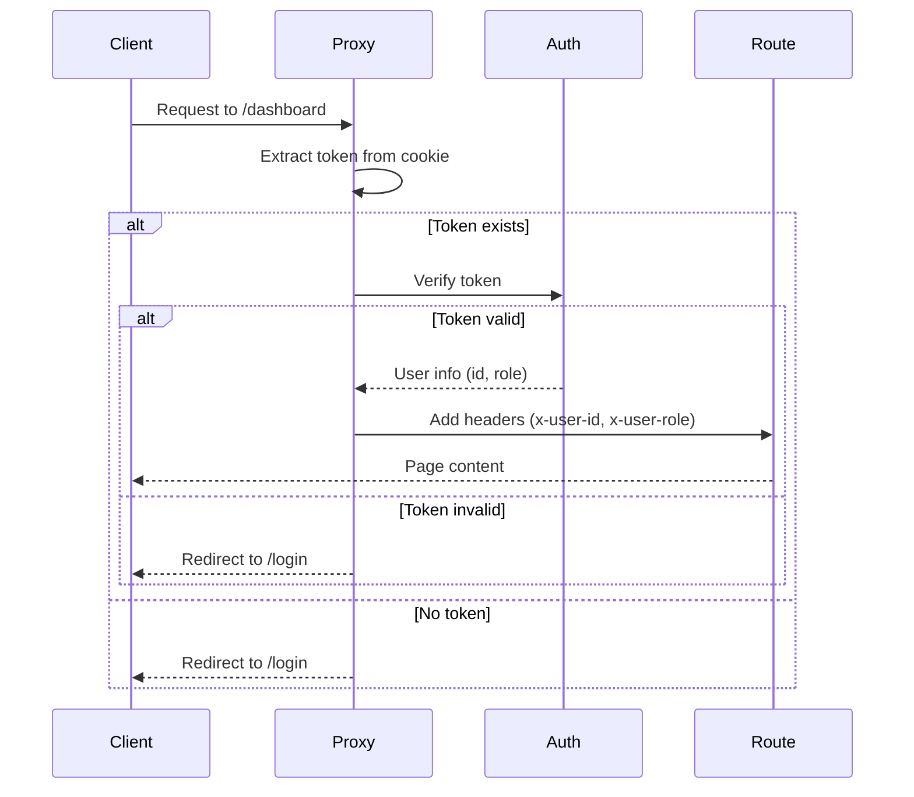

# Routes Organization Guide - ShopFlow POS

Complete guide to route organization, structure, and protection in the Next.js App Router.

---

## 📋 Table of Contents

1. [Introduction](#introduction)
2. [Current Folder Structure](#current-folder-structure)
3. [Route Types](#route-types)
4. [Route Groups](#route-groups)
5. [API Routes](#api-routes)
6. [Route Protection](#route-protection)
7. [Conventions and Best Practices](#conventions-and-best-practices)
8. [Diagrams](#diagrams)
9. [Practical Examples](#practical-examples)
10. [References](#references)

---

## Introduction

Next.js 16 uses the **App Router** with **file-based routing**. This means that the folder structure in `src/app/` directly maps to the URL structure of your application.

### Key Concepts

- **`page.tsx`**: Renders a page at that route
- **`layout.tsx`**: Wraps pages with a shared layout
- **`route.ts`**: Creates an API endpoint
- **Route Groups**: Folders wrapped in parentheses `(group)` don't appear in the URL but can share layouts
- **Dynamic Routes**: Folders with brackets `[id]` create dynamic route segments

### Why Route Organization Matters

A well-organized route structure:
- Makes navigation intuitive
- Simplifies route protection
- Improves code maintainability
- Facilitates team collaboration
- Enables better performance optimization

---

## Current Folder Structure

The current route structure in `src/app/`:

```
src/app/
├── (auth)/                    # Route group (doesn't appear in URL)
│   └── login/
│       └── page.tsx          # → /login
├── (dashboard)/               # Route group (doesn't appear in URL)
│   ├── layout.tsx            # Shared layout for dashboard routes
│   ├── admin/
│   │   └── loyalty/
│   │       └── page.tsx      # → /admin/loyalty
│   └── pos/
│       └── page.tsx          # → /pos
├── dashboard/
│   ├── layout.tsx            # Layout wrapper (re-exports from (dashboard))
│   └── page.tsx              # → /dashboard
├── api/                       # API routes
│   ├── auth/
│   │   ├── login/
│   │   │   └── route.ts      # → POST /api/auth/login
│   │   ├── logout/
│   │   │   └── route.ts      # → POST /api/auth/logout
│   │   └── me/
│   │       └── route.ts      # → GET /api/auth/me
│   ├── products/
│   │   ├── [id]/
│   │   │   ├── inventory/
│   │   │   │   └── route.ts  # → PUT /api/products/:id/inventory
│   │   │   └── route.ts      # → GET/PUT/DELETE /api/products/:id
│   │   ├── low-stock/
│   │   │   └── route.ts      # → GET /api/products/low-stock
│   │   └── route.ts          # → GET/POST /api/products
│   ├── sales/
│   │   ├── [id]/
│   │   │   ├── cancel/
│   │   │   │   └── route.ts  # → POST /api/sales/:id/cancel
│   │   │   ├── refund/
│   │   │   │   └── route.ts  # → POST /api/sales/:id/refund
│   │   │   └── route.ts      # → GET /api/sales/:id
│   │   └── route.ts          # → GET/POST /api/sales
│   └── ... (other resources)
├── layout.tsx                # Root layout (wraps all pages)
├── page.tsx                  # → / (landing page)
├── globals.css               # Global styles
└── favicon.ico               # Favicon
```

---

## Route Types

### Public Routes

Routes accessible without authentication:

#### `/` - Landing Page
- **File**: [`src/app/page.tsx`](../../src/app/page.tsx)
- **Type**: Server Component
- **Behavior**: 
  - Shows landing page for non-authenticated users
  - Redirects to `/dashboard` if user is authenticated
- **Protection**: None (public)

#### `/login` - Login Page
- **File**: [`src/app/(auth)/login/page.tsx`](../../src/app/(auth)/login/page.tsx)
- **Type**: Client Component (uses React Hook Form)
- **Behavior**: Login form with validation
- **Protection**: None (public)

### Protected Routes

Routes that require authentication:

#### `/dashboard` - Main Dashboard
- **File**: [`src/app/dashboard/page.tsx`](../../src/app/dashboard/page.tsx)
- **Type**: Client Component (uses React Query)
- **Layout**: Uses [`src/app/dashboard/layout.tsx`](../../src/app/dashboard/layout.tsx)
- **Protection**: Protected by proxy (redirects to `/login` if not authenticated)

#### `/pos` - Point of Sale
- **File**: [`src/app/(dashboard)/pos/page.tsx`](../../src/app/(dashboard)/pos/page.tsx)
- **Type**: Client Component
- **Layout**: Inherits from `(dashboard)/layout.tsx`
- **Protection**: Protected by proxy

#### `/admin/*` - Administration Routes
- **Example**: `/admin/loyalty`
- **File**: [`src/app/(dashboard)/admin/loyalty/page.tsx`](../../src/app/(dashboard)/admin/loyalty/page.tsx)
- **Type**: Client Component
- **Layout**: Inherits from `(dashboard)/layout.tsx`
- **Protection**: Protected by proxy (may require admin role in future)

---

## Route Groups

Route groups allow you to organize routes without affecting the URL structure. Folders wrapped in parentheses `(group)` don't appear in the URL.

### `(auth)` - Authentication Routes

**Purpose**: Group authentication-related pages

**Structure**:
```
(auth)/
└── login/
    └── page.tsx  # → /login (not /auth/login)
```

**Usage**: Currently only contains login, but can be extended with:
- `/register` (if needed)
- `/forgot-password` (if needed)
- `/reset-password` (if needed)

### `(dashboard)` - Dashboard Routes

**Purpose**: Share layout for all dashboard-related routes

**Structure**:
```
(dashboard)/
├── layout.tsx        # Shared layout (header, navigation)
├── admin/
│   └── loyalty/
│       └── page.tsx  # → /admin/loyalty
└── pos/
    └── page.tsx      # → /pos
```

**Layout**: [`src/app/(dashboard)/layout.tsx`](../../src/app/(dashboard)/layout.tsx)
- Provides header with "ShopFlow POS" title
- Wraps content in main container
- Shared across all routes in this group

**Note**: The `/dashboard` route is outside this group but uses the same layout via re-export in [`src/app/dashboard/layout.tsx`](../../src/app/dashboard/layout.tsx).

---

## API Routes

API routes are organized by resource following RESTful conventions.

### Structure Convention

```
api/
└── [resource]/
    ├── route.ts              # GET, POST /api/[resource]
    └── [id]/
        ├── route.ts          # GET, PUT, DELETE /api/[resource]/:id
        └── [action]/
            └── route.ts      # POST /api/[resource]/:id/[action]
```

### Public API Routes

#### `/api/auth/*` - Authentication Endpoints

**Public endpoints** (no authentication required):

- **POST `/api/auth/login`**
  - **File**: [`src/app/api/auth/login/route.ts`](../../src/app/api/auth/login/route.ts)
  - **Purpose**: User login
  - **Returns**: User data and sets HTTP-only cookie

- **POST `/api/auth/logout`**
  - **File**: [`src/app/api/auth/logout/route.ts`](../../src/app/api/auth/logout/route.ts)
  - **Purpose**: User logout
  - **Returns**: Clears authentication cookie

- **GET `/api/auth/me`**
  - **File**: [`src/app/api/auth/me/route.ts`](../../src/app/api/auth/me/route.ts)
  - **Purpose**: Get current user
  - **Note**: Requires authentication (reads token from cookie)

### Protected API Routes

All other API routes require authentication. The proxy middleware verifies the JWT token and adds user information to request headers.

#### Resource-Based Organization

**Products**: `/api/products/*`
- `GET /api/products` - List products
- `POST /api/products` - Create product
- `GET /api/products/:id` - Get product
- `PUT /api/products/:id` - Update product
- `DELETE /api/products/:id` - Delete product
- `PUT /api/products/:id/inventory` - Update inventory
- `GET /api/products/low-stock` - Get low stock products

**Sales**: `/api/sales/*`
- `GET /api/sales` - List sales
- `POST /api/sales` - Create sale
- `GET /api/sales/:id` - Get sale
- `POST /api/sales/:id/cancel` - Cancel sale
- `POST /api/sales/:id/refund` - Refund sale

**Reports**: `/api/reports/*`
- `GET /api/reports/stats` - Sales statistics
- `GET /api/reports/daily-sales` - Daily sales data
- `GET /api/reports/top-products` - Top products
- `GET /api/reports/payment-methods` - Payment method stats
- `GET /api/reports/inventory` - Inventory stats
- `GET /api/reports/sales-by-user` - Sales by user

**Other Resources**: `/api/customers`, `/api/categories`, `/api/suppliers`, `/api/users`, `/api/store-config`, `/api/loyalty`

### API Route Handler Pattern

All API routes follow this pattern:

```typescript
import { NextRequest, NextResponse } from 'next/server'
import { parseRequestBody, errorResponse, successResponse } from '@/lib/utils/api'
import { resourceSchema } from '@/lib/validations/resource'
import { resourceService } from '@/lib/services/resourceService'
import { ApiError, ErrorCodes } from '@/lib/utils/errors'

export async function GET(request: NextRequest) {
  try {
    // Extract user from headers (set by proxy)
    const userId = request.headers.get('x-user-id')
    
    // Fetch data using service layer
    const data = await resourceService.getAll()
    
    return successResponse(data)
  } catch (error) {
    return errorResponse(error)
  }
}

export async function POST(request: NextRequest) {
  try {
    // Parse and validate request body
    const body = await parseRequestBody<unknown>(request)
    const validated = resourceSchema.parse(body)
    
    // Extract user from headers
    const userId = request.headers.get('x-user-id')
    
    // Create resource using service layer
    const result = await resourceService.create(validated, userId!)
    
    return successResponse(result, 201)
  } catch (error) {
    return errorResponse(error)
  }
}
```

---

## Route Protection

Route protection is handled by the **proxy** (formerly middleware in Next.js 15).

### Proxy Location

**File**: [`src/proxy.ts`](../../src/proxy.ts)

### How It Works

1. **Token Extraction**: Reads JWT token from HTTP-only cookie
2. **Route Matching**: Checks if route requires protection
3. **Token Verification**: Validates token using `verifyToken()` from [`src/lib/auth.ts`](../../src/lib/auth.ts)
4. **Response**:
   - **Public routes**: Allow access
   - **Protected routes without token**: Redirect to `/login` (pages) or return 401 (API)
   - **Protected routes with valid token**: Add user info to headers and allow access

### Protection Logic

```typescript
// API routes
if (request.nextUrl.pathname.startsWith('/api')) {
  // Auth API routes are public
  if (request.nextUrl.pathname.startsWith('/api/auth')) {
    return NextResponse.next()
  }
  
  // Protected API routes
  if (!token) {
    return NextResponse.json({ error: 'Unauthorized' }, { status: 401 })
  }
  
  // Verify token and add user info to headers
  const decoded = verifyToken(token)
  requestHeaders.set('x-user-id', decoded.id)
  requestHeaders.set('x-user-role', decoded.role)
}

// Dashboard routes (protected)
const dashboardRoutes = ['/dashboard', '/pos']
if (isDashboardRoute) {
  if (!token) {
    return NextResponse.redirect(new URL('/login', request.url))
  }
}
```

### User Information in API Routes

When a protected API route is accessed, the proxy adds user information to request headers:

- **`x-user-id`**: User ID from JWT token
- **`x-user-role`**: User role (ADMIN, CASHIER, SUPERVISOR)

Access in route handlers:

```typescript
const userId = request.headers.get('x-user-id')
const userRole = request.headers.get('x-user-role')
```

---

## Conventions and Best Practices

### File Naming

- **Pages**: `page.tsx` (required name)
- **Layouts**: `layout.tsx` (required name)
- **API Routes**: `route.ts` (required name)
- **Dynamic Segments**: `[id]`, `[slug]` (brackets)

### Route Organization

1. **Group Related Routes**: Use route groups `(group)` to share layouts
2. **Keep Routes Flat**: Avoid deep nesting when possible
3. **Use Dynamic Routes**: For resource IDs, use `[id]` segments
4. **Separate Actions**: Use nested routes for actions (e.g., `/api/sales/:id/cancel`)

### Layout Hierarchy

Layouts are nested automatically:

```
app/layout.tsx                    # Root layout (all pages)
└── (dashboard)/layout.tsx        # Dashboard layout (dashboard routes)
    └── page.tsx                 # Page inherits both layouts
```

### Server vs Client Components

- **Default**: Server Components (no `'use client'`)
- **Use Client Components** when you need:
  - React hooks (`useState`, `useEffect`)
  - Event handlers (`onClick`, `onChange`)
  - Browser APIs
  - React Query hooks

### API Route Conventions

1. **Use Service Layer**: Delegate business logic to services in `src/lib/services/`
2. **Validate Input**: Use Zod schemas from `src/lib/validations/`
3. **Error Handling**: Use centralized error handling (`errorResponse`)
4. **HTTP Methods**: 
   - `GET` - Read operations
   - `POST` - Create operations
   - `PUT` - Update operations
   - `DELETE` - Delete operations
5. **Status Codes**:
   - `200` - Success
   - `201` - Created
   - `400` - Bad Request (validation errors)
   - `401` - Unauthorized
   - `404` - Not Found
   - `500` - Internal Server Error

---

## Diagrams

### Folder Structure

```mermaid
graph TD
    A[src/app/] --> B[page.tsx<br/>Landing Page /]
    A --> C[(auth)/<br/>Route Group]
    A --> D[(dashboard)/<br/>Route Group]
    A --> E[dashboard/<br/>Dashboard Route]
    A --> F[api/<br/>API Routes]
    
    C --> C1[login/page.tsx<br/>/login]
    
    D --> D1[layout.tsx<br/>Shared Layout]
    D --> D2[admin/loyalty/page.tsx<br/>/admin/loyalty]
    D --> D3[pos/page.tsx<br/>/pos]
    
    E --> E1[layout.tsx<br/>Layout Wrapper]
    E --> E2[page.tsx<br/>/dashboard]
    
    F --> F1[auth/<br/>Public API]
    F --> F2[products/<br/>Protected API]
    F --> F3[sales/<br/>Protected API]
    F --> F4[reports/<br/>Protected API]
    
    style C fill:#e1f5ff
    style D fill:#e1f5ff
    style F1 fill:#fff4e1
    style F2 fill:#ffe1e1
    style F3 fill:#ffe1e1
    style F4 fill:#ffe1e1
```

### Route Protection Flow



### API Route Protection Flow


---

## Practical Examples

### Example 1: Creating a New Protected Route

**Goal**: Create a new `/products` page to manage products.

**Steps**:

1. **Create the page file**:
   ```
   src/app/(dashboard)/products/page.tsx
   ```

2. **The route will automatically be**:
   - URL: `/products`
   - Protected: Yes (inherits from `(dashboard)` group)
   - Layout: Uses `(dashboard)/layout.tsx`

3. **Example code**:
   ```typescript
   'use client'
   
   import { useProducts } from '@/hooks/useProducts'
   
   export default function ProductsPage() {
     const { data: products, isLoading } = useProducts()
     
     if (isLoading) return <div>Loading...</div>
     
     return (
       <div>
         <h1>Products</h1>
         {/* Product list */}
       </div>
     )
   }
   ```

### Example 2: Creating a New API Route

**Goal**: Create a new endpoint `GET /api/products/search?q=term`.

**Steps**:

1. **Create the route file**:
   ```
   src/app/api/products/search/route.ts
   ```

2. **Implement the handler**:
   ```typescript
   import { NextRequest } from 'next/server'
   import { successResponse, errorResponse } from '@/lib/utils/api'
   import { productService } from '@/lib/services/productService'
   
   export async function GET(request: NextRequest) {
     try {
       const { searchParams } = new URL(request.url)
       const query = searchParams.get('q') || ''
       
       const products = await productService.search(query)
       
       return successResponse(products)
     } catch (error) {
       return errorResponse(error)
     }
   }
   ```

3. **The route will automatically be**:
   - URL: `/api/products/search?q=term`
   - Protected: Yes (all `/api/*` except `/api/auth/*`)
   - User info: Available via `request.headers.get('x-user-id')`

### Example 3: Adding Protection to an Existing Route

**Goal**: Protect a route that's currently public.

**Steps**:

1. **Add route to protected list in proxy**:
   ```typescript
   // src/proxy.ts
   const protectedRoutes = ['/dashboard', '/pos', '/your-new-route']
   ```

2. **Or move route to `(dashboard)` group**:
   ```
   src/app/(dashboard)/your-new-route/page.tsx
   ```

### Example 4: Creating a Dynamic Route

**Goal**: Create `/products/[id]` to view a single product.

**Steps**:

1. **Create dynamic route**:
   ```
   src/app/(dashboard)/products/[id]/page.tsx
   ```

2. **Access the ID parameter**:
   ```typescript
   export default async function ProductDetailPage({
     params,
   }: {
     params: { id: string }
   }) {
     const product = await getProductById(params.id)
     return <div>{product.name}</div>
   }
   ```

---

## References

### Next.js Documentation

- [Next.js App Router](https://nextjs.org/docs/app)
- [Routing](https://nextjs.org/docs/app/building-your-application/routing)
- [Route Groups](https://nextjs.org/docs/app/building-your-application/routing/route-groups)
- [Dynamic Routes](https://nextjs.org/docs/app/building-your-application/routing/dynamic-routes)
- [API Routes](https://nextjs.org/docs/app/building-your-application/routing/route-handlers)
- [Middleware](https://nextjs.org/docs/app/building-your-application/routing/middleware)

### Project Files

- **Proxy**: [`src/proxy.ts`](../../src/proxy.ts)
- **Authentication**: [`src/lib/auth.ts`](../../src/lib/auth.ts)
- **API Utilities**: [`src/lib/utils/api.ts`](../../src/lib/utils/api.ts)
- **Error Handling**: [`src/lib/utils/errors.ts`](../../src/lib/utils/errors.ts)

### Related Guides

- [Setup Guide](./01-setup.md) - Project setup and configuration
- [Technology Stack](./02-technology-stack.md) - Technology decisions
- [Conventions](./03-conventions.md) - Code conventions and patterns

---

---

## Adding Routes to Sidebar Navigation

When creating a new route/page in the dashboard, you need to add it to the sidebar navigation.

### Steps to Add a Route to Sidebar

1. **Create the route/page** first in `src/app/(dashboard)/` or `src/app/dashboard/`

2. **Open** `src/components/layout/Sidebar.tsx`

3. **Add the route** to the `navItems` array:

```typescript
const navItems: NavItem[] = [
  // ... existing items
  {
    title: 'Your New Page',        // Display name in sidebar
    href: '/your-new-route',        // Route path (must match actual route)
    icon: YourIcon,                 // Icon from lucide-react
    module: Module.YOUR_MODULE,      // Module for permission check (optional)
  },
]
```

4. **Import the icon** from `lucide-react` at the top of the file

5. **Set the module** (if the route requires permissions):
   - If the route should be visible based on permissions, set `module: Module.YOUR_MODULE`
   - If the route should always be visible (like Dashboard), omit the `module` property

### Example: Adding a Products Page

```typescript
import { Package } from 'lucide-react'  // Add import

const navItems: NavItem[] = [
  // ... existing items
  {
    title: 'Productos',
    href: '/products',
    icon: Package,
    module: Module.PRODUCTS,  // Only shows if user has Products module access
  },
]
```

### Important Notes

- **Only add routes that exist**: The sidebar will show the link, but if the route doesn't exist, users will get a 404 error
- **Permission-based visibility**: Routes with a `module` property will only show if the user has access to that module
- **Route must be created first**: Always create the actual route/page before adding it to the sidebar
- **Icons**: Use icons from `lucide-react` - browse available icons at [lucide.dev](https://lucide.dev)

### Current Sidebar Routes

The sidebar currently shows these routes (only if they exist and user has permissions):

- `/dashboard` - Dashboard (always visible)
- `/pos` - Point of Sale (requires Sales module access)
- `/products` - Products (requires Products module access) - **Add when route is created**
- `/customers` - Customers (requires Customers module access) - **Add when route is created**
- `/reports` - Reports (requires Reports module access) - **Add when route is created**
- `/admin/loyalty` - Loyalty Configuration (requires Loyalty module access)
- `/admin/settings` - Store Settings (requires Store Config module access) - **Add when route is created**

**Note**: Routes marked with "Add when route is created" should only be added to the sidebar after the actual page/route has been implemented.

---

## 📋 Rutas Faltantes y Organización Recomendada

Basándose en el análisis de funcionalidades faltantes en el sidebar (ver `docs/plans/03-sidebar-design.md`), se identificaron las siguientes rutas que deberían implementarse:

### Rutas de Módulos Ya Implementados en API

#### 1. Gestión de Inventario (`/inventory`)
- **Estado**: API implementada, UI faltante
- **Ubicación recomendada**: `src/app/(dashboard)/inventory/page.tsx`
- **Funcionalidades**:
  - Vista general de inventario
  - Ajustes de stock manuales
  - Alertas de stock bajo
  - Movimientos de inventario
- **Subrutas sugeridas**:
  - `/inventory/adjustments` - Ajustes de inventario
  - `/inventory/low-stock` - Productos con stock bajo
  - `/inventory/transfers` - Transferencias entre tiendas (futuro)

#### 2. Proveedores (`/suppliers`)
- **Estado**: API implementada, UI faltante
- **Ubicación recomendada**: `src/app/(dashboard)/suppliers/page.tsx`
- **Funcionalidades**:
  - Lista de proveedores
  - Crear/editar proveedores
  - Información de contacto
- **Subrutas sugeridas**:
  - `/suppliers/[id]` - Detalle de proveedor
  - `/suppliers/new` - Nuevo proveedor

#### 3. Gestión de Usuarios (`/admin/users`)
- **Estado**: API implementada, UI faltante
- **Ubicación recomendada**: `src/app/(dashboard)/admin/users/page.tsx`
- **Funcionalidades**:
  - Lista de usuarios
  - Crear/editar usuarios
  - Asignación de roles
  - Gestión de permisos
- **Subrutas sugeridas**:
  - `/admin/users/[id]` - Detalle de usuario
  - `/admin/users/new` - Nuevo usuario

#### 4. Copias de Seguridad (`/admin/backup`)
- **Estado**: API implementada, UI faltante
- **Ubicación recomendada**: `src/app/(dashboard)/admin/backup/page.tsx`
- **Funcionalidades**:
  - Crear respaldo
  - Lista de respaldos
  - Descargar respaldos
  - Restaurar desde respaldo
  - Configuración de respaldos automáticos

#### 5. Importar/Exportar (`/admin/import-export`)
- **Estado**: Parcialmente implementado, UI faltante
- **Ubicación recomendada**: `src/app/(dashboard)/admin/import-export/page.tsx`
- **Funcionalidades**:
  - Importar productos desde CSV/Excel
  - Exportar datos de módulos
  - Configuración de sincronización

### Rutas de Módulos por Implementar

#### 6. Gestión de Caja (`/cash-register`)
- **Estado**: No implementado
- **Ubicación recomendada**: `src/app/(dashboard)/cash-register/page.tsx`
- **Funcionalidades futuras**:
  - Apertura/cierre de caja
  - Control de efectivo
  - Arqueo de caja
  - Reportes de caja
- **Subrutas sugeridas**:
  - `/cash-register/open` - Abrir caja
  - `/cash-register/close` - Cerrar caja
  - `/cash-register/reports` - Reportes de caja

#### 7. Compras/Procurement (`/purchases`)
- **Estado**: No implementado
- **Ubicación recomendada**: `src/app/(dashboard)/purchases/page.tsx`
- **Funcionalidades futuras**:
  - Órdenes de compra
  - Recepción de mercancía
  - Gestión de proveedores
- **Subrutas sugeridas**:
  - `/purchases/orders` - Órdenes de compra
  - `/purchases/receive` - Recepción de mercancía
  - `/purchases/[id]` - Detalle de orden

#### 8. Servicios (`/services`)
- **Estado**: No implementado
- **Ubicación recomendada**: `src/app/(dashboard)/services/page.tsx`
- **Funcionalidades futuras**:
  - Catálogo de servicios
  - Precios de servicios
  - Programación de citas
- **Subrutas sugeridas**:
  - `/services/[id]` - Detalle de servicio
  - `/services/new` - Nuevo servicio

#### 9. Gestión de Precios (`/pricing`)
- **Estado**: Parcialmente implementado
- **Ubicación recomendada**: `src/app/(dashboard)/pricing/page.tsx`
- **Funcionalidades futuras**:
  - Gestión masiva de precios
  - Historial de cambios
  - Reglas de precios dinámicos

### Estructura de Rutas Recomendada

```
src/app/(dashboard)/
├── dashboard/page.tsx          # Dashboard principal
├── pos/page.tsx                # Punto de venta
├── cash-register/              # Gestión de caja (futuro)
│   ├── page.tsx
│   ├── open/page.tsx
│   └── close/page.tsx
├── products/                   # Productos (ya existe)
│   └── [id]/page.tsx
├── services/                   # Servicios (futuro)
│   ├── page.tsx
│   └── [id]/page.tsx
├── pricing/page.tsx            # Gestión de precios (futuro)
├── inventory/                  # Inventario (por implementar)
│   ├── page.tsx
│   ├── adjustments/page.tsx
│   └── low-stock/page.tsx
├── customers/                  # Clientes (ya existe)
│   └── [id]/page.tsx
├── suppliers/                  # Proveedores (por implementar)
│   ├── page.tsx
│   ├── [id]/page.tsx
│   └── new/page.tsx
├── purchases/                  # Compras (futuro)
│   ├── page.tsx
│   ├── orders/page.tsx
│   └── receive/page.tsx
├── reports/                    # Reportes (ya existe)
│   ├── sales/page.tsx
│   └── inventory/page.tsx
├── admin/                      # Administración
│   ├── users/                  # Usuarios (por implementar)
│   │   ├── page.tsx
│   │   ├── [id]/page.tsx
│   │   └── new/page.tsx
│   ├── loyalty/page.tsx        # Lealtad (ya existe)
│   ├── backup/page.tsx         # Backup (por implementar)
│   └── import-export/page.tsx  # Import/Export (por implementar)
└── layout.tsx                  # Layout compartido
```

### Integración con Sidebar

Una vez implementadas las rutas, deben agregarse al sidebar siguiendo el patrón establecido:

```typescript
// src/components/layout/Sidebar.tsx
const navItems: NavItem[] = [
  // ... items existentes

  // Grupo: Principal
  {
    title: 'Caja',
    href: '/cash-register',
    icon: Calculator,  // o similar
    module: Module.SALES,  // o módulo específico
  },

  // Grupo: Gestión
  {
    title: 'Servicios',
    href: '/services',
    icon: Wrench,
    module: Module.PRODUCTS,
  },
  {
    title: 'Precios',
    href: '/pricing',
    icon: DollarSign,
    module: Module.PRODUCTS,
  },
  {
    title: 'Inventario',
    href: '/inventory',
    icon: Package,
    module: Module.INVENTORY,
  },

  // Grupo: Administración
  {
    title: 'Proveedores',
    href: '/suppliers',
    icon: Truck,
    module: Module.SUPPLIERS,
  },
  {
    title: 'Compras',
    href: '/purchases',
    icon: ShoppingCart,
    module: Module.PURCHASES,
  },
  {
    title: 'Usuarios',
    href: '/admin/users',
    icon: Users,
    module: Module.USERS,
  },

  // Grupo: Avanzado
  {
    title: 'Copias de Seguridad',
    href: '/admin/backup',
    icon: HardDrive,
    module: Module.BACKUP,
  },
  {
    title: 'Importar/Exportar',
    href: '/admin/import-export',
    icon: FileUp,
    module: Module.EXPORT,
  },
]
```

### Consideraciones para Implementación

1. **Permisos**: Cada nueva ruta debe verificar permisos usando el sistema existente
2. **Grupos de rutas**: Usar `(dashboard)` para rutas protegidas del dashboard
3. **API Routes**: Crear endpoints API correspondientes para cada módulo nuevo
4. **Testing**: Implementar tests unitarios y de integración para nuevas rutas
5. **Documentación**: Actualizar esta guía conforme se implementen nuevas rutas

---

## Priorización de Implementación

### Fase 1: Módulos Críticos (Ya implementados en API)
1. **Gestión de Inventario** (`/inventory`) - Alto impacto en operaciones diarias
2. **Proveedores** (`/suppliers`) - Necesario para gestión de compras
3. **Usuarios** (`/admin/users`) - Administración del sistema
4. **Copias de Seguridad** (`/admin/backup`) - Seguridad de datos

### Fase 2: Módulos de Alto Valor
1. **Caja** (`/cash-register`) - Control financiero
2. **Importar/Exportar** (`/admin/import-export`) - Migración de datos

### Fase 3: Módulos Futuros
1. **Compras** (`/purchases`) - Gestión de procurement
2. **Servicios** (`/services`) - Expansión del negocio
3. **Precios** (`/pricing`) - Gestión avanzada de precios

---

**Last Updated**: 2025-01-04  
**Status**: Complete

