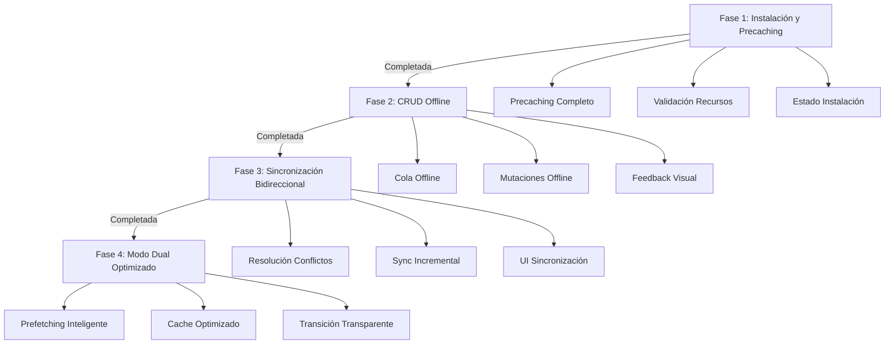

# Plan de Implementación PWA - Fases Completas

## Resumen de Fases

Este documento describe las 4 fases para implementar una PWA 100% instalable y funcional offline.

### Fase 1: Instalación PWA 100% Offline y Precaching Completo ✅

**Estado:** Completada

**Objetivo:** Asegurar que la PWA se puede instalar sin depender de internet y que después de la instalación funcione completamente offline sin necesidad de navegar manualmente.

**Archivos del plan:** [Fase 1](./pwa_instalación_y_funcionamiento_offline_completo_-_fase_1_c6aca271.plan.md)

**Resultado:**
- ✅ Precaching mejorado con reintentos
- ✅ Validación de recursos críticos
- ✅ Componente de estado de instalación
- ✅ La app funciona offline inmediatamente después de instalar

---

### Fase 2: Funcionamiento Offline Completo - Operaciones CRUD

**Estado:** Pendiente

**Objetivo:** Asegurar que todas las operaciones CRUD (Create, Read, Update, Delete) funcionen completamente offline, guardando cambios localmente y sincronizándolos cuando haya conexión.

**Archivos del plan:** [Fase 2](./07-pwa-fase-2-funcionamiento-offline-completo.md)

**Tareas principales:**
- Mejorar cola offline en service worker
- Crear servicio de cola offline mejorado
- Mejorar hooks de mutación para modo offline
- Crear hook de cola offline
- Mejorar componente de estado de sincronización

---

### Fase 3: Sincronización Bidireccional Mejorada

**Estado:** Pendiente

**Objetivo:** Mejorar la sincronización bidireccional para manejar conflictos, optimizar el proceso, y asegurar consistencia de datos entre cliente y servidor.

**Archivos del plan:** [Fase 3](./08-pwa-fase-3-sincronizacion-bidireccional.md)

**Tareas principales:**
- Mejorar servicio de sincronización
- Agregar timestamps de sincronización
- Crear sistema de resolución de conflictos
- Mejorar UI de sincronización
- Optimizar sincronización incremental

---

### Fase 4: Modo Dual Online/Offline Optimizado ✅

**Estado:** Completada

**Objetivo:** Optimizar el funcionamiento en ambos modos (online y offline) para que la transición sea transparente y el rendimiento sea óptimo en ambos casos.

**Archivos del plan:** [Fase 4](./09-pwa-fase-4-modo-dual-optimizado.md)

**Resultado:**
- ✅ Detección de conectividad mejorada con ping al servidor
- ✅ Servicio de prefetching inteligente basado en patrones de usuario
- ✅ Estrategias de cache inteligentes (stale-while-revalidate, cache-first, etc.)
- ✅ Sistema de sincronización en background con priorización
- ✅ Optimizaciones de rendimiento offline (virtualización, debouncing, lazy loading)

---

## Flujo de Implementación

## Orden de Implementación

1. **Fase 1** ✅ - Base: Instalación y precaching
2. **Fase 2** ✅ - Funcionalidad: CRUD offline completo
3. **Fase 3** ✅ - Sincronización: Manejo de conflictos y optimización
4. **Fase 4** ✅ - Optimización: Modo dual perfecto

## Dependencias entre Fases

- **Fase 2** ✅ depende de **Fase 1** (precaching y validación)
- **Fase 3** ✅ depende de **Fase 2** (cola offline y mutaciones)
- **Fase 4** ✅ depende de **Fase 3** (sincronización mejorada)

## Resultado Final Esperado

Después de completar las 4 fases:

- ✅ PWA 100% instalable sin internet (desde localhost)
- ✅ Funciona completamente offline inmediatamente después de instalar
- ✅ Todas las operaciones CRUD funcionan offline
- ✅ Sincronización bidireccional robusta con manejo de conflictos
- ✅ Transición transparente entre modos online/offline
- ✅ Rendimiento óptimo en ambos modos
- ✅ Experiencia de usuario fluida sin importar el estado de conexión
- ✅ Detección de conectividad inteligente con ping al servidor
- ✅ Prefetching inteligente basado en patrones de usuario
- ✅ Estrategias de cache optimizadas (stale-while-revalidate, etc.)
- ✅ Sincronización en background con priorización inteligente
- ✅ Optimizaciones de rendimiento offline (virtualización, debouncing, lazy loading)
